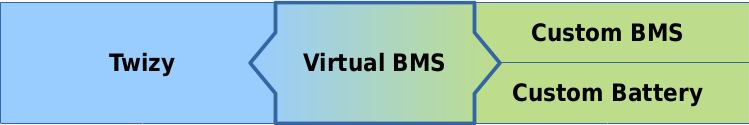

# Twizy Virtual BMS

This is an Arduino library providing an emulation of the CAN communication protocol of the BMS (battery management system) on a Renault Twizy.

By reproducing the system interface of the original BMS, the Virtual BMS enables replacing the original by a custom battery without changing anything else on the Twizy.

The library provides an API to control power limits and charge current, so a wide range of batteries can be used. Even lead-acid is an option.

In the most simple case this can be used without any customization. The provided "SimpleBMS" example shows how to create a very basic battery monitoring by using the Arduino analog ports to measure the battery pack voltage and temperature.

If you'd like to contribute a specific BMS adaptation, please fork and add your code in the examples folder.

## Installation

To download, click the DOWNLOADS button in the top right corner, download the ZIP file. Start the Arduino IDE, select menu Sketch → Include Library → Add .ZIP library, select the ZIP file and click OK. Try out the examples included.

You will also need these libraries:
  - [MCP_CAN_lib by Cory Fowler](https://github.com/coryjfowler/MCP_CAN_lib)
  - …and one of…
    - [TimerOne by Paul Stoffregen](https://github.com/PaulStoffregen/TimerOne)
    - [FlexiTimer2 by Paul Stoffregen](https://github.com/PaulStoffregen/FlexiTimer2)
    - [TimerThree by Paul Stoffregen](https://github.com/PaulStoffregen/TimerThree)

To get the smallest possible ROM & RAM footprint, set `TWIZY_DEBUG_LEVEL` to 0 and `DEBUG_MODE` of the MCP_CAN library to 0. This reduces the core memory usage of the VirtualBMS library to (currently) 8338 bytes ROM and 403 bytes RAM.

## Documentation

  - [API reference](API.md)
  - [History](HISTORY.md)

  - [Twizy CAN object dictionary](https://docs.google.com/spreadsheets/d/1gOrG9rnGR9YuMGakAbl4s97a6irHF6UNFV1TS5Ll7MY)
  - [Twizy BMS protocol](extras/Protocol.ods)

  - [Battery connection scheme](extras/Twizy-BMS-wiring-scheme.pdf)
  - [List of parts](extras/Twizy-Battery-Part-List.md)

  - [SEVCON configuration](extras/SEVCON-Configuration.md)
  - [Charger configuration](extras/CHARGER-Configuration.md)

  - [Prototype](extras/Prototype-Blazej.md)

## Hardware requirements

  - **Battery**: you will need battery cells capable of producing enough voltage and current for the Twizy. You don't need to exactly match the original voltage and power range. The SEVCON G48 series can operate with input voltages from 19.3 to 69.6 V. The Twizy SEVCON is by default configured for a range of 39 to 65 V, but that can be modified (see [SEVCON configuration](extras/SEVCON-Configuration.md)). In standard configuration, the Twizy will draw up to ~330 A or 16 kW from the battery, and recuperate at up to ~70 A or 3.5 kW. If your battery cannot cope with this, you can either use the Virtual BMS to lower the limits or modify the SEVCON configuration.
  
    Pascal is using Nissan Leaf cells, which offer a very good combination of capacity, availability and price. Blazej is using cheap 120 Ah lead acid batteries (price ~400 Euro for a complete set). Klaus will use chinese prismatic cells adding up to ~12 kWh.
    
    **Note**: Klaus offers to organize a bulk order of high capacity prismatic 3.2V LiFePO4 cells in the range of 330€ down to 260€/kWh. For a high performance large capacity setup with 48V 240 Ah (double of the standard battery capacity) a total price only for the battery pack between 2800 and 3200€ seems possible. Each buyer would have the risk in case of failures and should add some spare cells. For details please contact Klaus at <klauszinser@posteo.eu>.
  
  - **BMS**: using a BMS is optional for lead acid batteries but _strongly recommended_ for lithium based batteries. You may pick any BMS, but you should focus on those that can be connected to the Arduino to query the battery state. Our recommendation is picking a good BMS capable of early balancing, monitoring the coulomb (Ah) consumption and calculating the real SOC.

    **Note**: Pascal is developing a **fully integrated BMS solution** supporting various cell & chemistry configurations and containing the complete Twizy interface. The BMS should be available by the end of 2017. Pricing is expected to be around 350 Euro. Using this BMS will both simplify custom battery integration and reduce points of failure. You won't need an Arduino when using this BMS. For details please contact him at <pascal@ripp.li>.

  - **Arduino**: to run the Twizy Virtual BMS you will need some Arduino and some MCP CAN interface. A wide range of hardware options is available. The code perfectly fits into an Arduino Nano leaving enough memory to implement quite complex custom logics. You should pick an MCP 2515 SPI CAN module with at least 16 MHz clock rate. IRQ connection is optional.

    **Note**: Michael offers to customize the Virtual BMS for individual applications and BMS integration. For details please contact him at <dexter@dexters-web.de>.

  - **Connection**: see the [part list](extras/Twizy-Battery-Part-List.md) for relais and connectors needed.

  - **Battery case**: you can use the original Twizy battery case, available as a replacement part from Renault (see part list).
  
    **Note**: Lutz Schäfer offers to build individual custom battery cases offering more space. For details please contact him at <aquillo@t-online.de>.

## Compliance

As the Virtual BMS (as well as the OVMS and other Twizy tools) is based on re-engineering of the CAN protocol, a 100% compliance cannot be reached. There are still unknown fields and codes, look for question marks in the CAN object dictionary for details. Unknown parts may have an effect under special conditions that could not be produced during analysis.

Having said that, the BMS protocol emulation has successfully been tested and is actually being used in real Twizys, enabling the full standard operation using custom batteries.

If you encounter any kind of issue, please send us all details including a full CAN trace for analysis.

## Authors

This library has been created and is maintained by Michael Balzer (<dexter@dexters-web.de> / https://dexters-web.de/).

The CAN & hardware protocol decoding and reengineering has been done by a joint effort of (in reverse alphabetical order):

  - Lutz Schäfer <aquillo@t-online.de> -- Hardware development
  - Pascal Ripp <pascal@ripp.li> -- Hardware protocol decoding & implementation
  - Bernd Eickhoff <b.eickhoff@gmx.de> -- CAN logging & testing
  - Michael Balzer <dexter@dexters-web.de> -- CAN protocol decoding & implementation

Special thanks to Klaus Zinser <klauszinser@posteo.eu> for support and to Blazej Blaszczyk <blazej.blaszczyk@pascal-engineering.com> for prototype implementation and testing!

Btw: we're all available for **consulting**, **integration** and **customization** jobs.

## Donations

**Donations** to support our efforts and further development are very welcome.  
Please send donations via **Paypal** to: `virtualbms@dexters-web.de`  
**Thanks! :-)**

Donors will be honored in our [Hall of Eternal Fame](DONORS.md), please add a comment to your donation if you'd rather stay anonymous.

## License

This library is free software; you can redistribute it and/or modify it under the terms of the [GNU Lesser General Public License](https://www.gnu.org/licenses/lgpl.html) as published by the Free Software Foundation; either version 3 of the License, or (at your option) any later version.

This library is distributed in the hope that it will be useful, but WITHOUT ANY WARRANTY; without even the implied warranty of MERCHANTABILITY or FITNESS FOR A PARTICULAR PURPOSE.  See the GNU Lesser General Public License for more details.

You should have received a copy of the GNU Lesser General Public License along with this library; if not, write to the Free Software Foundation, Inc., 51 Franklin St, Fifth Floor, Boston, MA  02110- 1301  USA

**Have fun!**
