# Build #2 by Błażej Błaszczyk using Nissan Leaf cells

Błażejs second battery is based on used Nissan Leaf cells. Błażej bought a used 2015 Nissan 24 kWh pack for 14000 PLN (~3300 EUR).

The 24 kWh pack consists of 48 modules with ~500 Wh each. He disassembled the pack and managed to put 21 modules into the Twizy (tight fit, original case won't fit around these).

This pack uses a simple standard 14 cell hardware BMS for the cell protection and balancing (hosted on the lower PCB). The upper PCB hosts the VirtualBMS Arduino components, basically following the [example scheme](https://github.com/dexterbg/Twizy-Virtual-BMS/blob/master/extras/Twizy-Battery-Part-List.md#example-arduino-wiring-scheme). Cell voltages are measured using voltage dividers over a multiplexer, pack current is measured using a LEM hall sensor and temperatures using LM35. An HC-06 module is included for Bluetooth connectivity.

Real world driving range with this 10.5 kWh pack is around 130-140 km. Due to the higher capacity, the battery voltage is more stable than the original battery, even under high load.

If you'd like to know more, contact Błażej Błaszczyk <blazej.blaszczyk@pascal-engineering.com>.

## Images

(click to zoom)

[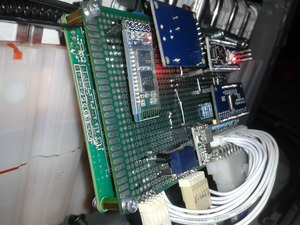](Blazej2-Leaf-Cells/20170730_235336-nm.jpg)
[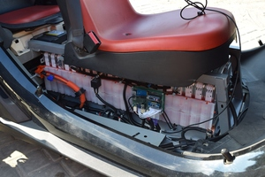](Blazej2-Leaf-Cells/DSC_0007-nm.jpg)
[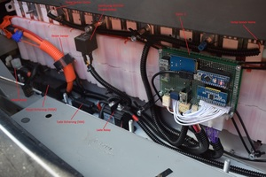](Blazej2-Leaf-Cells/DSC_0009+info-nm.jpg)
[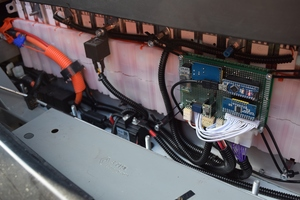](Blazej2-Leaf-Cells/DSC_0009-nm.jpg)
[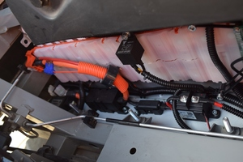](Blazej2-Leaf-Cells/DSC_0010-nm.jpg)
[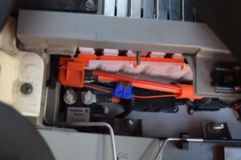](Blazej2-Leaf-Cells/DSC_0011-nm.jpg)
[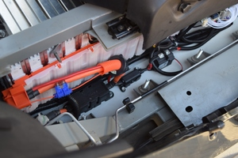](Blazej2-Leaf-Cells/DSC_0012-nm.jpg)
[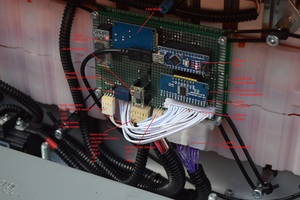](Blazej2-Leaf-Cells/DSC_0014+info-nm.jpg)
[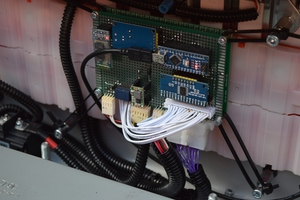](Blazej2-Leaf-Cells/DSC_0014-nm.jpg)
[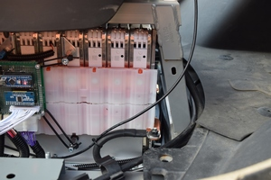](Blazej2-Leaf-Cells/DSC_0015-nm.jpg)
[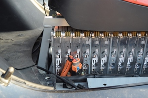](Blazej2-Leaf-Cells/DSC_0016-nm.jpg)
[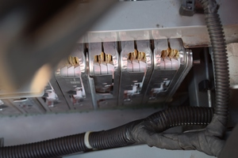](Blazej2-Leaf-Cells/DSC_0019-nm.jpg)
[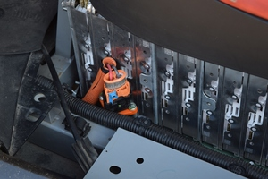](Blazej2-Leaf-Cells/DSC_0022-nm.jpg)

