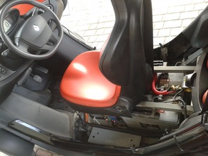
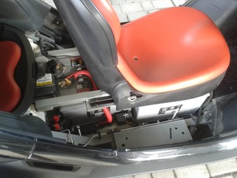
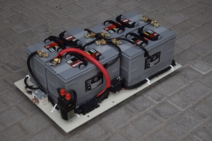
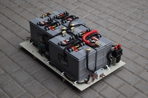
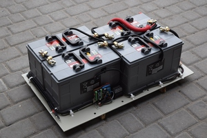
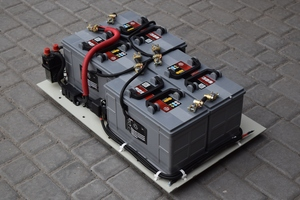
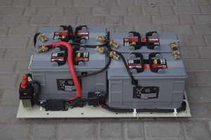
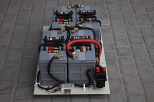
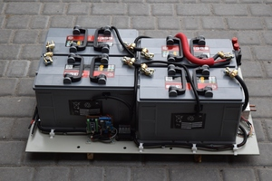
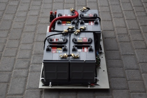

# Prototype build by Blazej Blaszczyk 

This is a prototype actually powering Blazejs own Twizy.

It uses four standard 120 Ah lead acid batteries. Range with new batteries is ~ 50-60 km on flat terrain.

No Renault parts have been used. The main power relais is from a fork lift.

There is no BMS other than the Arduino (Nano) itself. The pack voltage is measured using a voltage divider, the pack temperature is measured using an LM35D sensor. SOC is derived from the (smoothed) pack voltage. The software is basically the "SimpleBMS" example from the library with calibration for Blazejs components.

If you'd like to know more, contact Blazej Blaszczyk <blazej.blaszczyk@pascal-engineering.com>.

## Images

(click to zoom)

