# Twizy Battery Part List

For explosion drawings and OE part numbers, see…

1. [partsouq.com](https://partsouq.com/en/catalog/genuine/vehicle?c=Renault&ssd=%24HAxLcgIFBQEDBA5SXAdCUkZQXEd0e1pcB19WWkBRXFBTOQoWRnN5BAsCDXEVOjkCamFBSEtkVSECMBNNV0dyAw%24&vid=1409&cid=2043523126&q=)
2. [catcar.info](https://www.catcar.info/renault/?lang=en&l=c3Q9PTUwfHxzdHM9PXsiMTAiOiJNb2RlbCIsIjIwIjoiVHdpenkiLCIzMCI6Ik1BTUEiLCI0MCI6Ik1hbnVhbCIsIjUwIjoiMTkgQ29vbGluZyBzeXN0ZW0gLSBSZXNlcnZvaXJzIC0gRXhoYXVzdCBzeXN0ZW0gLSBFbmdpbmUgbW91bnRpbmcgXC8gVHJhY3Rpb24gYmF0dGVyeSJ9fHxub3Bycz09MTQwOXx8YnJhbmQ9PVJlbmF1bHR8fG5vcHI9PTE0MDl8fHR5cGU9PU1BTUF8fGNhdF9pZD09TXx8aW1nPT0wMTA0MDI2NHx8Z3JwX2lkPT0xOXx8c3ViR3JwX2lkPT0xOUd8fGNybnROb3ByPT0xNDA5fHxyZWZhY2Nlcz09TjE5OTAwMA%3D%3D)

A good source for all parts is [JC Parts](https://www.jcparts.eu/).

## Fuses, connectors and relais

| # | Image | Part | OE number | ~Price |
| --- | --- | --- | --- | --- |
| 1x | [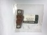](parts/296539341R-nm.jpg) | Fusible Principal Fltg Ent Chr   *Main fuse 500A* | 296539341R | 4.41 € |
| 1x | [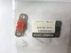](parts/296539051R-nm.jpg) | Fusible Chargeur Fltg Ent Chrj   *Charge fuse 50A* | 296539051R | 1.67 € |
| 1x |  | Fusible Apres Contact Fltg Ent   *Precharge fuse 5A* | 296535672R | 1.30 € |
| 1x | [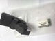](parts/296713282R-nm.jpg) | Platine Fusible   *Main fuse holder* | 296713282R | 10.48 € |
| 1x | [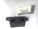](parts/296712452R-nm.jpg) | Platine Fusible   *Charge fuse holder* | 296712452R | 7.96 € |
| 1x | [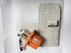](parts/296743399R-nm.jpg) | Embase Connecteur Batterie Tra   *Main connector (DELPHI)* | 296743399R | 52.22 € |
| 1x |  | Embase Connecteur Ba   *Charge connector (DELPHI)* | 296746418R | 30.67 € |
| 1x | [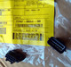](parts/296740718R-nm.jpg) | Embase Connecteur   *Signal connector (Yazaki)* | 296740718R | 86.30 € |
| 1x | [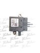](parts/294B16331R-nm.jpg) | Relais Principal Boitier Cnx P   *Main relais 150A* | 294B16331R | 56.63 € |
| 1x |  | Relais Precharge Boitier Cnx P   *Precharge relais 10A* | 294B20431R | 21.19 € |
| 1x | [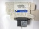](parts/296156226R-nm.jpg) | Relais Chargeur Fltg Ent Chrjr   *Charge relais 40A* | 296156226R | 39.96 € |
| | | **Total**  *(prices may change)* | | **~ 310 €** |

Parts may of course be replaced by functionally compatible ones, for example use a fork lift relais for the main power relais (relais & fuses are no special parts). Błażej Błaszczyk has built his [prototype](Prototype-Blazej.md) without using Renault parts. For details please contact him at <blazej.blaszczyk@pascal-engineering.com>.

  - The `296740718R` signal connector is Yazaki part no. [7282-8854-30](http://connectors-catalog.sys.yzk.co.jp/yazaki-web/servlet/SubServlet_e?forward=7282-8854-30&plist=detail&select=XX) (contact terminals sold separate).
  - The `296743399R` main power connector is DELPHI part no. [F473110](http://ecat.delphi.com/feature?search=F473110), with contact terminals [F176600](http://ecat.delphi.com/feature?search=F176600).
  - The `296746418R` charger power connector is DELPHI part no. [F873110](ecat.delphi.com/feature?search=F873110), with contact terminals [15516298](http://ecat.delphi.com/feature?search=15516298).

## Casing

| # | Image | Part | OE number | ~Price |
| --- | --- | --- | --- | --- |
| 1x | [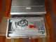](parts/295F00162R-nm.jpg) | CARTER SUP BATTERI	  *Casing cover* | 295F00162R | 129 € |
| 1x | [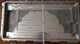](parts/295F19016R-nm.jpg) | CARTER INF BATTERI   *Casing base* | 295F19016R | 216 € |
| 1x |  | JOINT ETC CARTER B   *Casing seal* | 295G32560R | 46 € |
| | | **Total**  *(prices may change)* | | **~ 390 €** |

**Note**: Lutz Schäfer offers to build individual custom battery cases offering more space. For details please contact him at <aquillo@t-online.de>.

__Sizes__:
  - Standard Renault Box: 724 x 368 x 208 mm
  - Lutz-Box V1 (without car modification): 745 x 400 x 245 mm
  - Lutz-Box V2 (car modification necessary): 745 x 480 x 245 mm

## Arduino

**Note**: if you plan to use **Pascals integrated Twizy BMS**, you won't need an Arduino. The integrated BMS also implements the Twizy protocol.

For a basic setup you'll need an Arduino, a CAN interface and a relais to switch the 3MW signal.

If you want/need to measure cell voltages and temperatures with the Arduino, you will most probably need some analog input extension. A very simple and cheap setup for up to 16 cells is to use an analog multiplexer based on the CD74HC4067 chip.

Standard Arduinos can be powered from 12V, but will burn the voltage difference (convert to heat), so a step-down voltage regulator is highly recommended. The [Pololu A-Star SV series](https://www.pololu.com/category/149/a-star-programmable-controllers) has on-board step-down regulators suitable for a 12V supply.

Using an Arduino Uno style main board with shields reduces soldering requirements but needs more money and space than for example a Nano based board with break out components.

Keep in mind for all setups, this is an automotive application: expect high levels of mechanical stress due to road shocks and temperature expansion/contraction. Protect your electronics against humidity.

**Price note**: there are lots of cheap Arduino clones available. These can of course be used as well. Expect a lower build quality, so better order some spares (always a good idea).

### Example basic Uno/Shield setup

| Category | Component | ~Price |
| --- | --- | --- |
| Main+Power | Pololu A-Star 32U4 Prime SV | 24.95 € |
| CAN | Seeed Studio CAN-BUS Shield v1.2 | 24.95 € |
| Relais | Seeed Studio Relais Shield V3.0 | 21.95 € |
| **Total** | | **~ 72 €** |

### Example basic Nano setup

| Category | Component | ~Price |
| --- | --- | --- |
| Main | Arduino Nano V3 clone | 4.95 € |
| I/O | Arduino NANO Screw Terminal Expansion Board | 4.95 € |
| CAN | NiRen MCP2515_CAN (TJA1050) | 4.50 € |
| CAN | … 16 MHz quartz | 0.23 € |
| Relais | 5V 2 Channel Relay Shield | 2.95 € |
| **Total** | | **~ 18 €** |

### Example components

| Category | Component | ~Price |
| --- | --- | --- |
| Main | Arduino Uno R3 | 20.80 € |
| Main | Arduino Nano V3 | 23.80 € |
| Main+Power | Pololu A-Star 32U4 Prime SV | 24.95 € |
| Power | Pololu 5V, 2.5A Step-Down Voltage Regulator D24V22F5 | 8.95 € |
| CAN | Seeed Studio CAN-BUS Shield v1.2 | 24.95 € |
| CAN | NiRen MCP2515_CAN (TJA1050)   *Note: these come with 8 MHz quartz, you should replace this with a 16 MHz type* | 4.50 € |
| Relais | Seeed Studio Relais Shield V3.0 | 21.95 € |
| Relais | 5V 2 Channel Relay Shield | 2.95 € |
| I/O | Adafruit Proto-Screwshield | 15.50 € |
| I/O | Arduino NANO Screw Terminal Expansion Board | 4.95 € |
| I/O | SparkFun Analog/Digital MUX Breakout - CD74HC4067 (16 Channel) | 4.95 € |
| I/O | Adafruit ADS1015 12-Bit ADC - 4 Channel | 10.95 € |
| I/O | Mayhew Labs Extended ADC Shield | 30 € |
| I/O | Seeed Studio RS232 Shield | 12.50 € |
| I/O | HC-05 Bluetooth module | 6.00 € |

### Example Arduino wiring scheme

This example setup could be used for a battery pack with a very basic BMS that does only cell protection and has no communication interface. So the Arduino is used to monitor cell voltages, pack current and temperature. This is all optional -- basically you could derive the SOC estimation from just the overall pack voltage as well.

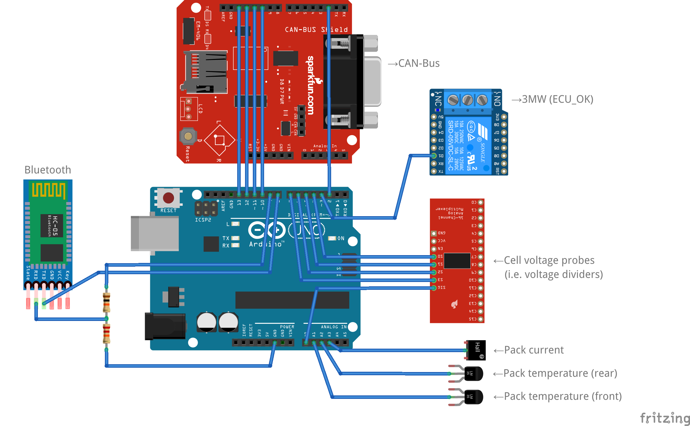

  - [PDF](Arduino-Example-Wiring.pdf)
  - [Fritzing file](Arduino-Example-Wiring.fzz)

The Fritzing diagram only shows the I/O connections, but there's little more: add power supply and enable the multiplexer permanently (connect pin EN to VCC). Obviously, when using a CAN shield like shown in the diagram, it's wiring is done by mounting the shield.

The bluetooth module is optional but neat, it enables to check your VirtualBMS output with a smartphone.

Cell voltages can be measured using the multiplexer shown and simple voltage dividers measuring the stacked voltages, but keep in mind you lose precision by the scaling. The Arduino analog ports provide 10 bit resolution on the voltage range of 0-5 V = ~5 mV. So when scaling to 60 V, resolution drops to ~60 mV. This is good enough to detect a bad cell, but not for precise health monitoring. You may use ADC shields with higher resolution and/or differential voltage probes to get the single cell voltages, but when thinking about this, take a look at specialized battery monitoring chips like the MAX11080 or LTC6811 first.

The pack current can be measured using either a shunt (with an [instrumentation amplifier](http://www.vwlowen.co.uk/arduino/current/current.htm) or an [ADC with preamp](http://arduinotronics.blogspot.de/2015/05/reading-current-shunt-with-arduino.html)) or a hall sensor module like the [LEM HAC 600-S](http://www.lem.com/hq/de/component/option,com_catalog/task,displaymodel/id,64.05.52.000.0/) or the [Tamura L06P400S05](http://www.tamuracorp.com/clientuploads/pdfs/engineeringdocs/L06PXXXS05.pdf). The LEM outputs -4…+4 V so needs to be mapped to the Arduino's 0…5 V (i.e. using an offset voltage divider), the Tamura outputs 0…5 V (2.5 V = 0 A) so can be used directly.

The temperatures can be measured using LM35 sensors. Depending on the variant used, voltage may need to be mapped to the Arduino input. If you want to measure every single cell temperature, you can also extend the setup by another MUX for the temperature sensors -- just use the same address pins as for the voltage MUX.

